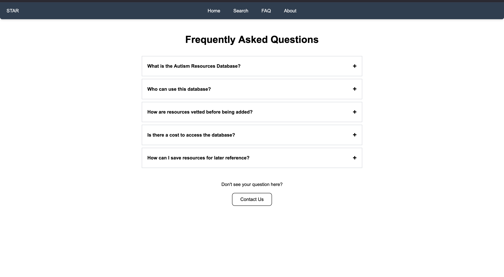
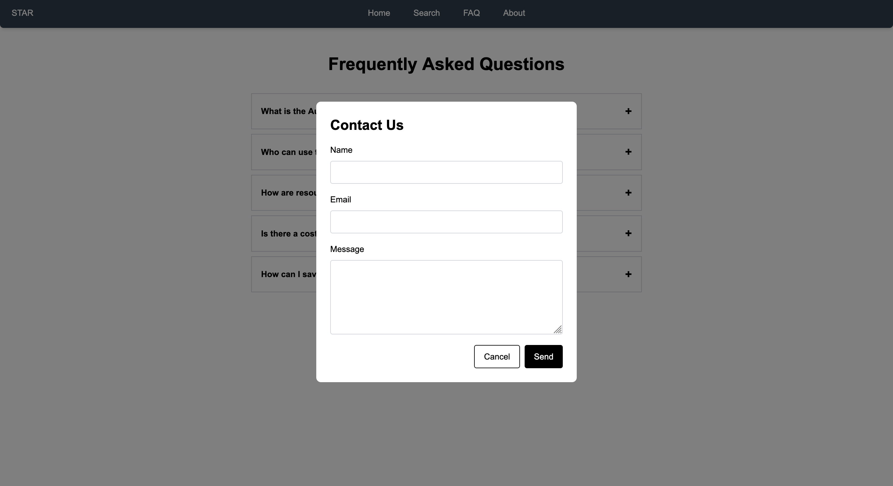

# Contact Us

You can contact us by locating the following buttons under the FAQ and About tabs.

<figure style="max-width:120%; margin:auto;">
  <figcaption style="text-align:center;">A red circle around the FAQ and About tabs is shown in the top of the navigation bar.</figcaption>
</figure>

After entering the page, scroll to the bottom to find a button that looks like this:

<figure style="max-width:120%; margin:auto;">
  <figcaption style="text-align:center;">A black bordered button is located at the bottom of the FAQ page named "Contact Us".</figcaption>
</figure>

You should be greeted with a pop-up that looks like this:

<figure style="max-width:120%; margin:auto;">
  <figcaption style="text-align:center;">A pop-up that contains a field for the email, name of user, and message they wish to send.</figcaption>
</figure>

We'll try to respond to any questions as soon as we can!