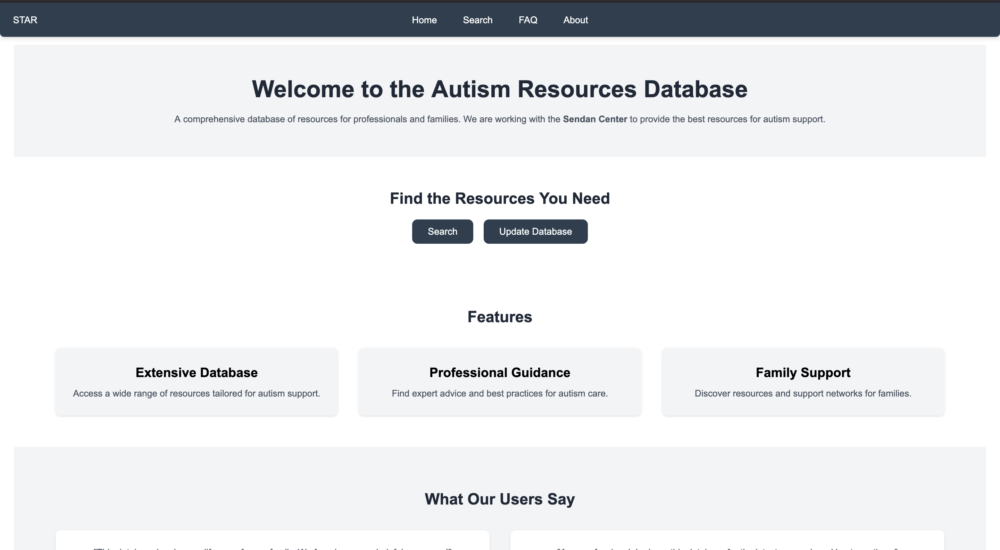

# Navigating the Site

Upon entering the website, you should see this in front of you:

<figure style="max-width:120%; margin:auto;">
  <figcaption style="text-align:center;">The home page of the website with a navigation bar, search button, and Update Database button</figcaption>
</figure>

On the top of the website, you should be able to see "Home", "Search", "FAQ", and "About". In the middle of the screen, you should be able to see the "Search", and "Update Database" button.

The **Home** button takes you back to the page of the image above. Both the "**Search**" tab and "**Search**" button will take you to the Search page, where you are able to search through our database for info on various psychiatric treatments retrieved from Pubmed. The **FAQ** tab takes you to some commonly asked questions, and the **About** tab introduces our mission, who we work with, and who we are!

At the bottom of the **Home** page, you can find various links to Autism Resources, which you can visit to learn more about Autism, how it affects people, and what you can do to understand it better.
