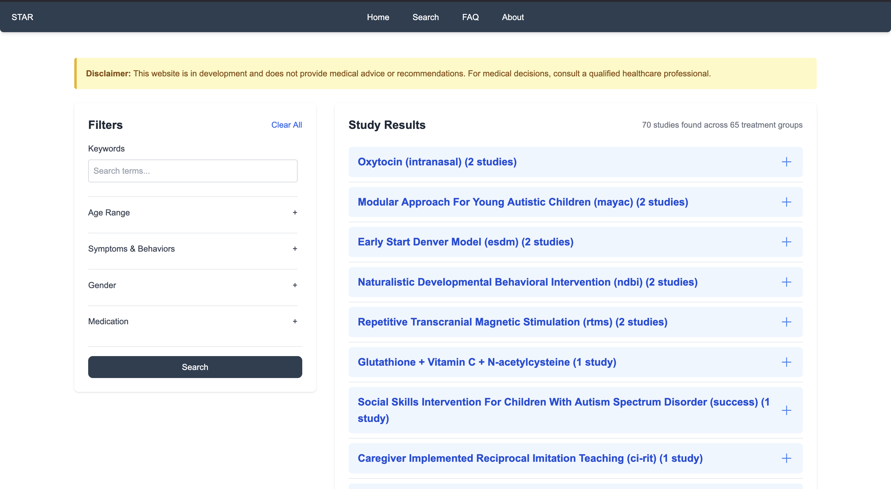

# Search Guide

In this page, you will be able to learn how to search effectively in our database.

Upon entering the Search Page, you should be greeted with this:

<figure style="max-width:120%; margin:auto;">
  <figcaption style="text-align:center;">A page containing the results of searching on the right, and filtering with detailed searching on the left in a box.</figcaption>
</figure>

