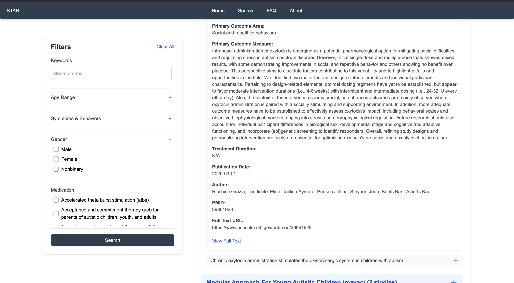
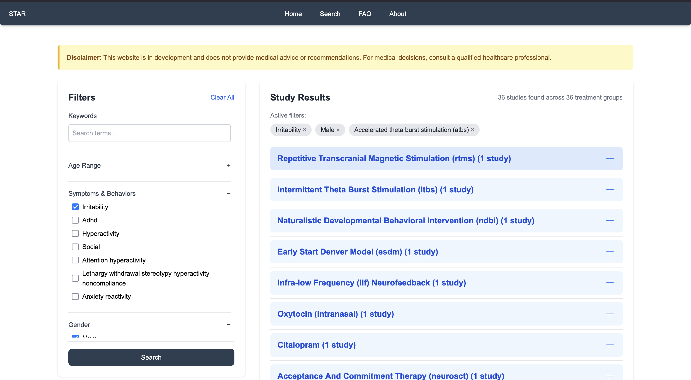
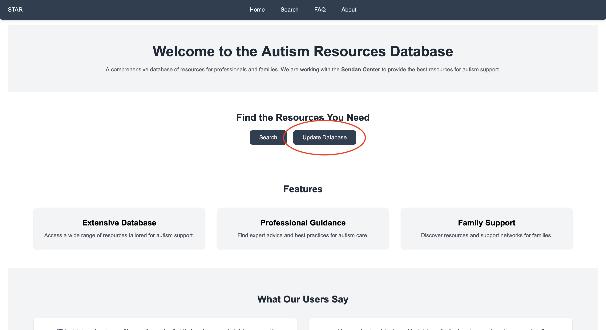

# Search Guide

In this page, you will be able to learn how to search effectively in our database.

Upon entering the Search Page, you should be greeted with this:

<figure style="max-width:120%; margin:auto;">
  <figcaption style="text-align:center;">A page containing the results of searching on the left, and filtering with detailed searching on the right in a box.</figcaption>
</figure>

## Results

To the left are the studies that pertain to your search. By default, all studies are loaded. You can click on a treatment title and bring up the relevant studies. Clicking on the study will bring up a brief summary, including the **primary outcome area**, **primary outcome measure**, **the treatment duration**, **publication date**, **authors**, **PMID** in Pubmed, and the **link** to the study in Pubmed.

<figure style="max-width:120%; margin:auto;">
  <figcaption style="text-align:center;">A page containing the results of searching on the left, and more detailed information on a study about a certain treatment within a box.</figcaption>
</figure>

## Filters

You can also include filters for your search. We have **age**, **symptoms and behaviors**, **gender**, and **medication type** as available filters, to narrow down the result.

<figure style="max-width:120%; margin:auto;">
  <figcaption style="text-align:center;">An example of filters applied to a search. Currently, the search is filtered by male, anxiety symptoms, and 6 - 12 years old.</figcaption>
</figure>

## Most Recent Results

If you feel like the studies are out-of-date, please click the **Update Database** button on the Home Page. This will update our database and help detect the most up-to-date papers. The database can only be updated once per day due to the AI needing one day to finish. We appreciate your patience for the needed time.

<figure style="max-width:120%; margin:auto;">
  <figcaption style="text-align:center;">The Update Database button is highlighted on the home page with a red circle.</figcaption>
</figure>

We normally update our database once a week on Mondays, so if a paper came out after then, please feel free to update.
